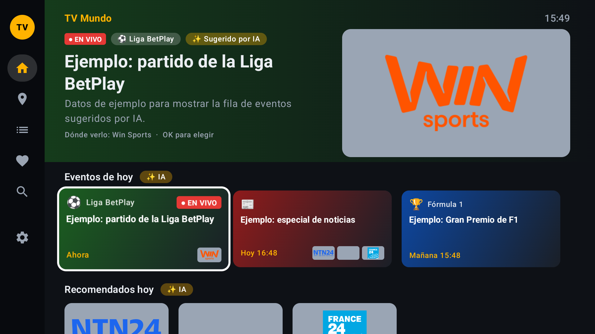
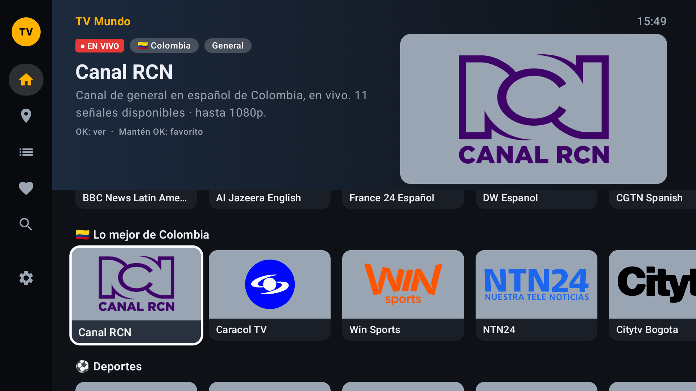
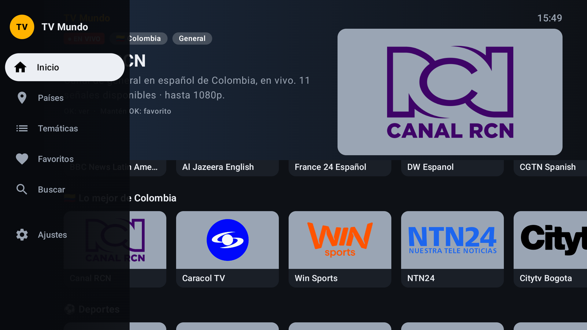
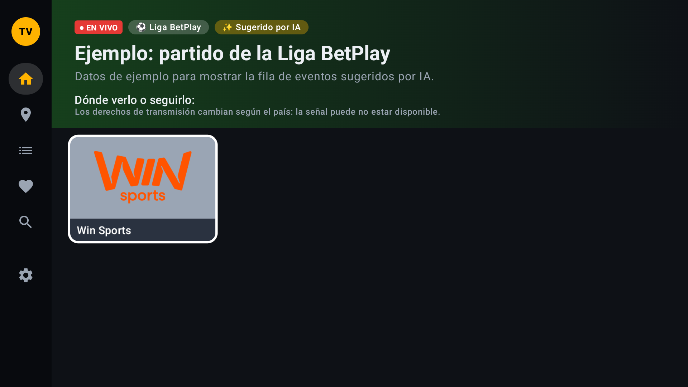
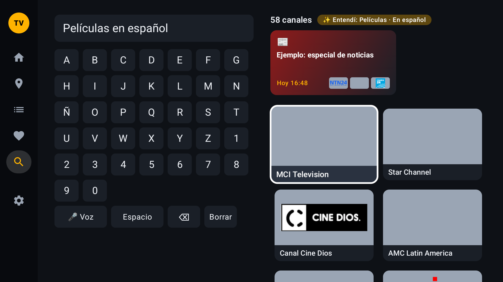
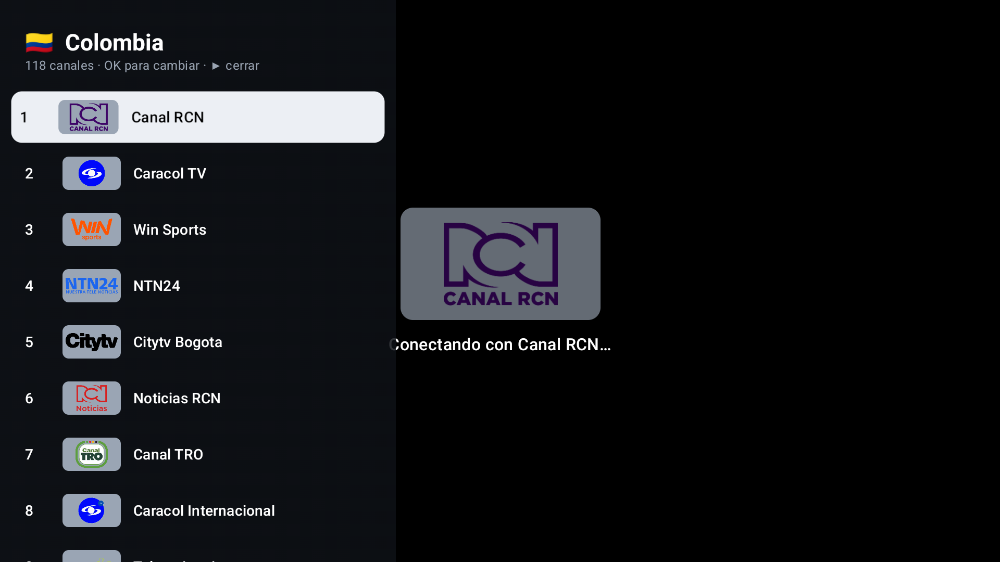
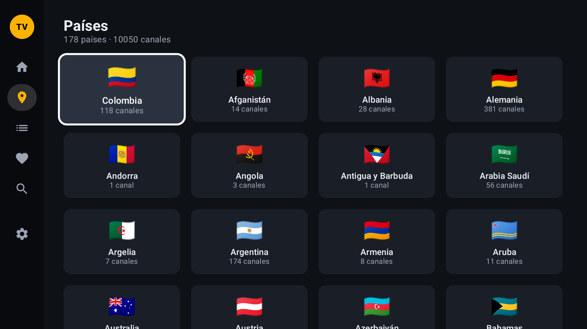
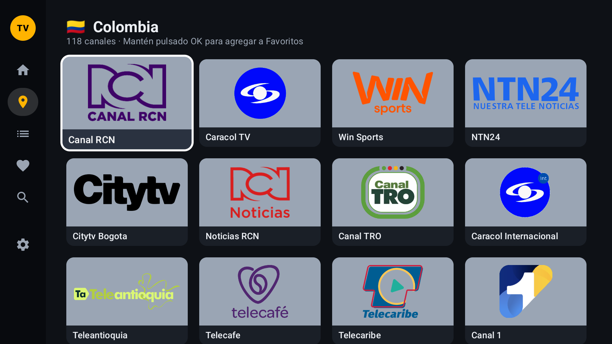
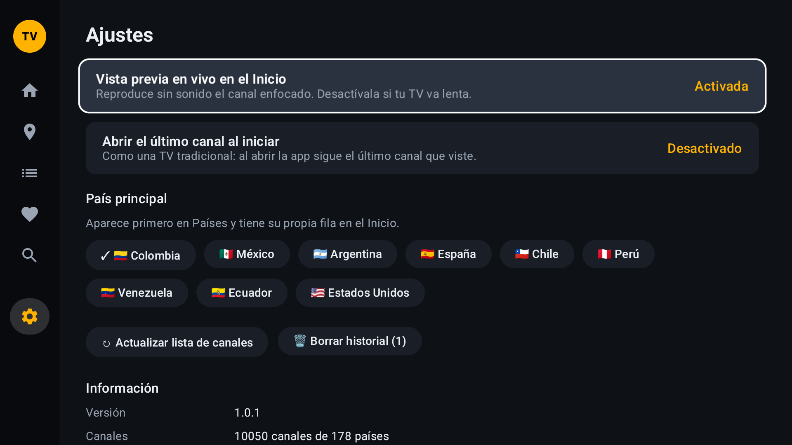
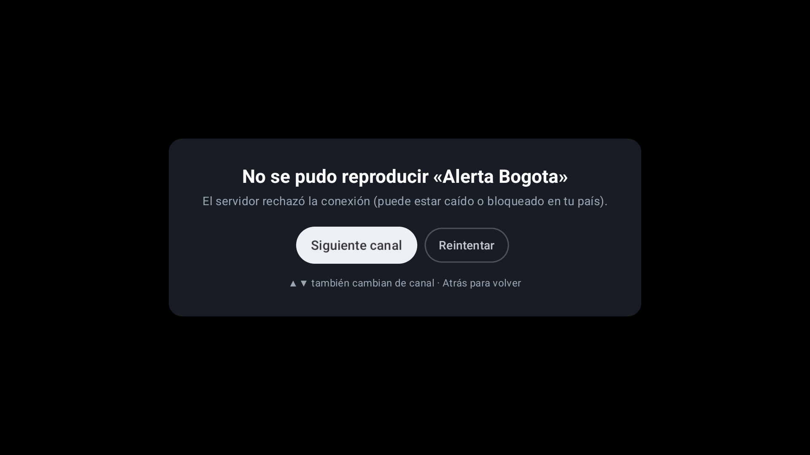

# TV Mundo 📺🌎


App de IPTV para **Android TV / Google TV** (probada en un emulador de Google TV y pensada para TVs Xiaomi) con más de 10.000 canales de TV en vivo gratuitos de todo el mundo, tomados de la API pública de [iptv-org](https://github.com/iptv-org/iptv).

- Inicio tipo **Google TV / Pluto TV**: barra lateral, panel con **vista previa en vivo** del canal enfocado y filas temáticas.
- **Eventos del día sugeridos con IA** (Claude + búsqueda web): partidos, noticias y especiales, con los canales donde verlos.
- Recomendaciones **"Para ti"**, **"Seguir viendo"** y los **canales más reconocidos del mundo**.
- **Búsqueda inteligente** en lenguaje natural ("fútbol argentino", "noticias de Colombia") y **por voz**.
- Interfaz 100 % en español, tema oscuro, todo navegable con el control remoto (D-pad).
- Kotlin + Jetpack Compose for TV + Media3 ExoPlayer (HLS). Sin cuentas ni anuncios.

**⬇️ Descargar el último APK:** [tv-mundo.apk](https://github.com/Jnavarro4/tv-mundo/releases/latest/download/tv-mundo.apk) · [todas las versiones](https://github.com/Jnavarro4/tv-mundo/releases)

> TV Mundo no aloja ni retransmite contenido: solo reproduce las URLs públicas listadas por iptv-org. La disponibilidad de cada canal depende de su emisor (algunos fallan o están bloqueados por país).

---

## Pantallas

> En las capturas, los eventos y recomendados con IA son **datos de ejemplo** (dicen "Ejemplo:").

| Inicio: eventos del día (IA) | Inicio: vista previa del canal enfocado |
|---|---|
|  |  |
| **Menú lateral** | **Detalle de un evento** |
|  |  |
| **Búsqueda inteligente** | **Lista de canales en el reproductor** |
|  |  |
| **Países** | **Canales de un país** |
|  |  |
| **Ajustes** | **Canal caído** |
|  |  |

### Qué hay en cada sección

- **Inicio ("lobby")**: arriba se ve el canal o evento enfocado (país, temática, descripción) y, al dejar el foco quieto un segundo, una **vista previa en vivo sin sonido**. Abajo, filas:
  - ✨ **Eventos de hoy**: partidos y especiales de las próximas 36 h, con "EN VIVO" cuando están en curso.
  - **Seguir viendo**: tus últimos canales.
  - ✨ **Recomendados hoy**: canales elegidos por la IA con el motivo.
  - **Para ti**: aprende de lo que ves y de tus favoritos.
  - **Destacados**, 🌎 **Los más reconocidos del mundo**, ★ **Tus favoritos**, **Lo mejor de Colombia**.
  - **Deportes, Noticias, Películas, Series y novelas, Infantil, Música, Documentales y Entretenimiento**.
- **Países**: bandera y cantidad de canales; el país principal (Colombia por defecto) primero.
- **Temáticas**: categorías traducidas al español.
- **Favoritos**: se marcan con **pulsación larga en OK** sobre cualquier canal.
- **Buscar**: teclado en pantalla, 🎤 voz y búsqueda inteligente: entiende temática, país e idioma ("películas en español", "dibujos para niños", "deportes de México") y también busca en los eventos del día.
- **Ajustes**: vista previa en vivo sí/no, abrir el último canal al iniciar, país principal, actualizar la lista, borrar historial e información de la app.
- **Reproductor**: pantalla completa con número de canal, calidad y "siguiente". Si un stream falla prueba los demás del canal; si ninguno funciona ofrece **Siguiente canal** / **Reintentar**. Se recupera solo si el directo se atrasa.

## Uso con el control remoto

| Dónde | Tecla | Acción |
|---|---|---|
| Inicio y grillas | ◀ ▲ ▶ ▼ | Moverse (el elemento con foco se agranda y tiene borde blanco) |
| Inicio y grillas | ◀ en el borde | Abrir la barra lateral |
| Inicio y grillas | OK | Ver canal / abrir país, temática o evento |
| Inicio y grillas | **Mantener OK** | Agregar / quitar de Favoritos |
| Reproductor | ▲ / ▼ (o CH+ / CH-) | Canal anterior / siguiente de la lista |
| Reproductor | ◀ | Lista de canales para saltar directo |
| Reproductor | OK | Mostrar / ocultar la información del canal |
| Reproductor | Mantener OK (o Menú) | Agregar / quitar de Favoritos |
| Cualquier pantalla | Atrás | Volver (el foco vuelve a donde estabas). En el Inicio: primero la barra, luego salir |

## IA: eventos y recomendados del día

La app **no lleva ninguna clave de API**: la IA corre una vez al día en GitHub Actions y la app solo descarga el resultado.

```
GitHub Actions (05:00 Colombia)              Rama "datos"                 App en la TV
ia/generar_sugeridos.py ──► sugeridos.json ──► raw.githubusercontent ──► filas "Eventos de hoy"
 1. Claude + búsqueda web: eventos de           (eventos + canales)        y "Recomendados hoy"
    las próximas 36 h (fútbol, noticias…)                                  (se refresca cada hora)
 2. Claude (salida estructurada): los
    relaciona con canales reales de iptv-org
 3. Validación: solo ids de canal que existen
```

- Modelo: `claude-opus-5-5` con la herramienta de **búsqueda web** de la API de Claude y **salidas estructuradas** (JSON con esquema fijo). Los canales sugeridos se validan contra iptv-org: nunca aparecen canales inventados.
- Si un evento no tiene señal gratuita confirmada, la app lo dice y ofrece canales de esa temática.

### Activar la IA (una vez)

1. Crea una clave de API en [platform.claude.com](https://platform.claude.com) (requiere saldo).
2. Guárdala como secret del repositorio (no queda en el código ni en el APK):

   ```bash
   gh secret set ANTHROPIC_API_KEY --repo Jnavarro4/tv-mundo
   ```

3. Lanza la primera generación (luego corre sola todos los días):

   ```bash
   gh workflow run "Sugeridos con IA" --repo Jnavarro4/tv-mundo
   ```

Sin la clave, el workflow termina sin hacer nada y la app simplemente no muestra las filas con IA (todo lo demás funciona igual).

**Costo aproximado:** US$ 0,40–0,80 por ejecución (búsquedas web + tokens), unos US$ 15–25 al mes con una ejecución diaria. Para gastar menos, crea la variable del repositorio `MODELO_CLAUDE` con valor `claude-sonnet-5-5` (*Settings → Secrets and variables → Actions → Variables*), o cambia el `cron` del workflow para que corra con menos frecuencia.

Para probar el script sin gastar: `python ia/generar_sugeridos.py --solo-candidatos` muestra los canales que se le pasan a la IA.

> ¿Por qué no hay un chat de IA dentro de la app? Necesitaría una clave de API dentro del APK (cualquiera podría extraerla) o un servidor propio. La búsqueda inteligente local cubre ese uso sin conexión ni costo.

## Cómo editar los Destacados y los Reconocidos

- Destacados: [`FeaturedChannels.kt`](app/src/main/java/com/josenavarro/tvmundo/data/FeaturedChannels.kt)
- Los más reconocidos del mundo: [`WorldChannels.kt`](app/src/main/java/com/josenavarro/tvmundo/data/WorldChannels.kt)

```kotlin
object FeaturedChannels {
    val ids = listOf(
        "CaracolTV.co",
        "CanalRCN.co",
        // ...
        "France24.fr@Spanish",   // canal con varias señales: se elige el feed en español
    )
}
```

1. Busca el canal en <https://iptv-org.github.io/> (o en `https://iptv-org.github.io/api/channels.json`) y copia su `id` (por ejemplo `NTN24.co`).
2. Agrégalo a la lista en el orden en que quieres verlo.
3. Si el canal tiene señales en varios idiomas, añade `@feed` usando el campo `feed` de `streams.json` (por ejemplo `DW.de@Espanol`).
4. Haz commit y push a `main`: GitHub Actions compila y publica un APK nuevo automáticamente.

Los ids que no existan simplemente no se muestran. El test `CatalogBuilderTest.apiReal` verifica que todos existan en la API (ver "Compilar localmente").

## Instalar en la TV por ADB por Wi-Fi

Necesitas una PC en la misma red Wi-Fi que la TV y las [Android SDK Platform-Tools](https://developer.android.com/tools/releases/platform-tools) (traen `adb`).

1. **Activar las opciones de desarrollador en la TV**
   - Xiaomi / Google TV: *Configuración → Sistema → Información* y pulsa **7 veces** sobre *Compilación del SO de Android TV* hasta que diga "Ya eres desarrollador".
   - (En Android TV antiguo: *Configuración → Preferencias del dispositivo → Información → Compilación*).
2. **Activar la depuración**: *Configuración → Sistema → Opciones de desarrollador* → activa **Depuración por USB** (en algunos modelos también aparece **Depuración por red / ADB por red**: actívala).
3. **Averiguar la IP de la TV**: *Configuración → Red e Internet →* tu red Wi-Fi (por ejemplo `192.168.1.50`).
4. **Descargar el APK** en la PC: [tv-mundo.apk](https://github.com/Jnavarro4/tv-mundo/releases/latest/download/tv-mundo.apk).
5. **Conectar e instalar** desde la PC:

   ```bash
   adb connect 192.168.1.50:5555
   ```

   La TV mostrará "¿Permitir la depuración?": elige **Permitir siempre desde esta computadora** y vuelve a ejecutar `adb connect` si hace falta.

   ```bash
   adb install -r tv-mundo.apk
   ```

6. Abre **TV Mundo** desde la fila de apps de la TV (aparece con su banner).

Para actualizar, descarga el APK nuevo y repite `adb install -r tv-mundo.apk` (todas las versiones van firmadas con la misma clave, así que se actualiza sin perder favoritos ni historial).

> Si `adb connect` es rechazado en Google TV con Android 11+, usa *Opciones de desarrollador → Depuración inalámbrica → Vincular dispositivo con código*: `adb pair IP:PUERTO_DE_VINCULACIÓN`, escribe el código y luego `adb connect IP:PUERTO` con el puerto que muestra esa pantalla.

## Compilar localmente

Requisitos: **JDK 17** y el **Android SDK** (platform 36). Con Android Studio ya tienes ambos.

```bash
git clone https://github.com/Jnavarro4/tv-mundo.git
cd tv-mundo
./gradlew assembleDebug
```

El APK queda en `app/build/outputs/apk/debug/app-debug.apk` (en Windows usa `gradlew.bat assembleDebug`). Si Gradle no encuentra el SDK, crea `local.properties` con `sdk.dir=/ruta/al/Android/Sdk`. La versión `assembleRelease` usa R8 y es la más rápida en la TV.

### Tests

| Comando | Qué prueba |
|---|---|
| `./gradlew testDebugUnitTest` | Lógica (27 tests): armado del catálogo, ranking, búsqueda inteligente, eventos, historial, recomendaciones y filas del Inicio |
| `./gradlew connectedDebugAndroidTest` | Interfaz de punta a punta en un emulador o TV conectada (7 tests): Inicio con IA, control remoto, canal caído → siguiente, evento, búsqueda, favoritos, ajustes |
| `IPTV_API_DIR=/carpeta ./gradlew testDebugUnitTest` | Además, contra la API real: descarga los JSON de `https://iptv-org.github.io/api/` a esa carpeta |

## GitHub Actions

| Workflow | Cuándo | Qué hace |
|---|---|---|
| [Compilar y publicar APK](.github/workflows/release.yml) | Cada push a `main` | Tests unitarios, compila y crea un Release `v1.0.<n>` con `tv-mundo.apk` |
| [Tests de interfaz](.github/workflows/ui-tests.yml) | Cada push a `main` y PR | Corre los tests de interfaz en un emulador |
| [Sugeridos con IA](.github/workflows/sugeridos.yml) | Todos los días 05:00 (Colombia) y manual | Genera `sugeridos.json` y lo publica en la rama `datos` |

**Firma**: el repo incluye un keystore de depuración (`app/debug.keystore`, contraseña `android`) que usan tanto las compilaciones locales como las de CI. Así no hay que configurar secrets para compilar y todas las versiones se instalan encima de la anterior. Es una clave pública de pruebas: sirve para tu TV, **no** para publicar en Google Play.

## Cómo funciona

```
app/src/main/java/com/josenavarro/tvmundo/
├── data/
│   ├── ApiModels.kt            # Modelos de la API de iptv-org (esquema verificado)
│   ├── CatalogBuilder.kt       # Une canales + streams + logos, filtra y ordena
│   ├── CatalogRepository.kt    # Descarga, caché en disco y refresco cada 12 h
│   ├── CatalogIndex.kt         # Índices precalculados y ranking (español, país, logo, señal estable)
│   ├── SmartSearch.kt          # Búsqueda en lenguaje natural (local)
│   ├── Suggestions.kt          # Eventos/recomendados con IA (descarga del JSON)
│   ├── UserData.kt             # Historial, ajustes y recomendador "Para ti"
│   ├── FeaturedChannels.kt     # ← destacados editables
│   ├── WorldChannels.kt        # ← reconocidos del mundo editables
│   └── Translations.kt         # Categorías y países en español
├── player/
│   ├── PlayerScreen.kt         # Reproductor, lista lateral y teclas del control
│   ├── LivePreview.kt          # Vista previa en vivo del Inicio
│   └── StreamMediaSource.kt    # ExoPlayer/HLS con user_agent y referrer de cada stream
├── ui/                         # Barra lateral, Inicio (filas), pantallas y ViewModel
└── MainActivity.kt
ia/generar_sugeridos.py         # Generador de sugeridos con Claude (GitHub Actions)
```

- **Datos**: `channels.json`, `streams.json`, `countries.json`, `categories.json` y `logos.json` de iptv-org. Se unen por id de canal y se excluyen los canales NSFW, los cerrados y los que no tienen stream (~10.000 canales de ~180 países).
- **Rendimiento**: el catálogo procesado se guarda en disco y se abre al instante; los índices se calculan una vez en segundo plano (≈150 ms); los logos tienen caché en memoria y en disco; la versión release usa R8 y perfiles de compilación (`profileinstaller`). El reproductor usa un búfer inicial corto para cambiar de canal rápido y prueba señales alternativas automáticamente.
- **Streams**: por canal se ordenan primero las señales en español, luego las no geobloqueadas, las 24/7 y las de mejor calidad. Se envían el `user_agent` y el `referrer` que indica cada stream.
- **Requisitos de TV**: `LEANBACK_LAUNCHER`, banner 320×180, `android.software.leanback` y pantalla táctil no requerida. minSdk 21, targetSdk 36.

## Créditos

- Lista de canales: [iptv-org](https://github.com/iptv-org/iptv) (licencia Unlicense para los datos de la API).
- Sugeridos: generados con [Claude](https://www.anthropic.com/claude) (Anthropic).
- Logos y nombres de canales pertenecen a sus respectivos dueños.
