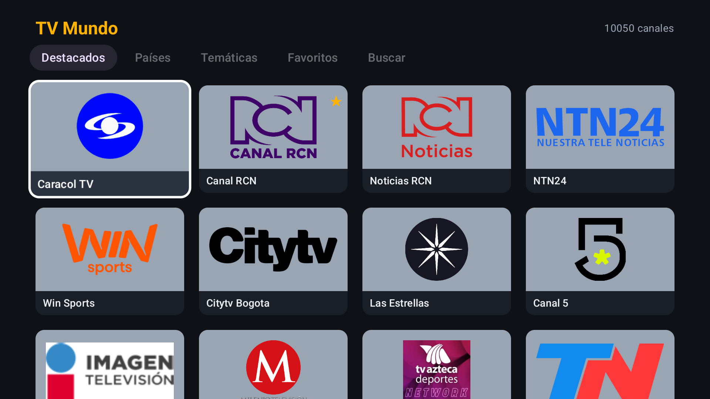
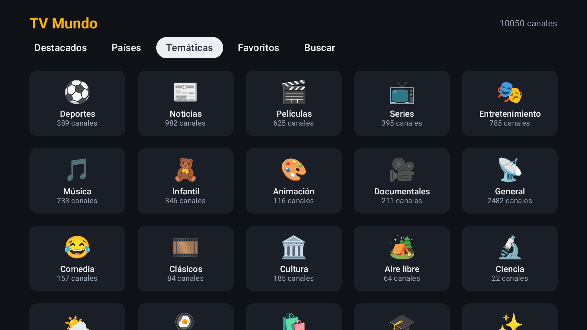
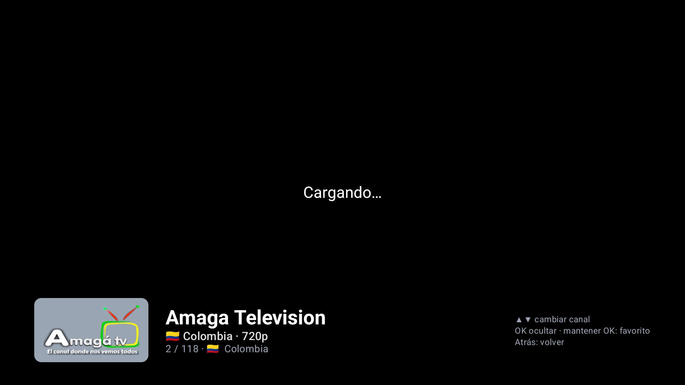

# TV Mundo 📺🌎


App de IPTV para **Android TV / Google TV** (probada en un emulador de Google TV, pensada para TVs Xiaomi) con miles de canales de TV en vivo gratuitos de todo el mundo, tomados de la API pública de [iptv-org](https://github.com/iptv-org/iptv).

- Interfaz 100 % en español, tema oscuro y navegable con el control remoto (D-pad).
- Kotlin + Jetpack Compose for TV + Media3 ExoPlayer (HLS).
- Sin cuentas, sin anuncios, sin servidores propios: la app solo lee la API de iptv-org.

**⬇️ Descargar el último APK:** [tv-mundo.apk](https://github.com/Jnavarro4/tv-mundo/releases/latest/download/tv-mundo.apk) · [todas las versiones](https://github.com/Jnavarro4/tv-mundo/releases)

> TV Mundo no aloja ni retransmite contenido: solo reproduce las URLs públicas listadas por iptv-org. La disponibilidad de cada canal depende de su emisor (algunos fallan o están bloqueados por país).

---

## Pantallas

| Destacados | Países |
|---|---|
|  |  |
| **Canales de un país** | **Temáticas** |
|  |  |
| **Buscar** | **Reproductor** |
|  |  |
| **Canal caído** | |
|  | |

- **Destacados**: unos 24 canales populares en español (Colombia, México, Argentina, España e internacionales). Se editan en un solo archivo (ver más abajo).
- **Países**: grilla con bandera y cantidad de canales; Colombia siempre primero y el resto en orden alfabético. Al entrar se ve la grilla de canales de ese país.
- **Temáticas**: Deportes, Noticias, Películas, Series, Entretenimiento, Música, Infantil, Documentales, etc., traducidas al español.
- **Favoritos**: los canales que marcaste. Se guardan en el equipo (DataStore).
- **Buscar**: teclado en pantalla manejable con el control; filtra por nombre (sin importar tildes ni mayúsculas).
- **Reproductor**: pantalla completa. Si un stream falla prueba automáticamente los otros streams del canal; si ninguno funciona muestra el aviso con **Siguiente canal** / **Reintentar**.

## Uso con el control remoto

| Dónde | Tecla | Acción |
|---|---|---|
| Grillas | ◀ ▲ ▶ ▼ | Moverse (el elemento con foco se agranda y tiene borde blanco) |
| Grillas | OK | Abrir país / temática o reproducir canal |
| Grillas | **Mantener OK** | Agregar / quitar de Favoritos (aparece ★ en la tarjeta) |
| Reproductor | ▲ / ▼ (o CH+ / CH-) | Canal anterior / siguiente de la lista actual |
| Reproductor | OK | Mostrar / ocultar la información del canal (logo, nombre, país) |
| Reproductor | Mantener OK (o Menú) | Agregar / quitar de Favoritos |
| Cualquier pantalla | Atrás | Volver (el foco vuelve al último canal o país) |

## Cómo editar los Destacados

La lista está en [`app/src/main/java/com/josenavarro/tvmundo/data/FeaturedChannels.kt`](app/src/main/java/com/josenavarro/tvmundo/data/FeaturedChannels.kt):

```kotlin
object FeaturedChannels {
    val ids = listOf(
        "CaracolTV.co",
        "CanalRCN.co",
        // ...
        "France24.fr@Spanish",   // canal con varias señales: se elige el feed en español
    )
}
```

1. Busca el canal en <https://iptv-org.github.io/> (o en `https://iptv-org.github.io/api/channels.json`) y copia su `id` (por ejemplo `NTN24.co`).
2. Agrégalo a la lista en el orden en que quieres verlo.
3. Si el canal tiene señales en varios idiomas, añade `@feed` usando el campo `feed` de `streams.json` (por ejemplo `DW.de@Espanol`).
4. Haz commit y push a `main`: GitHub Actions compila y publica un APK nuevo automáticamente.

Los ids que no existan o se queden sin streams simplemente no se muestran. El test `CatalogBuilderTest.apiReal` verifica que todos los destacados existan en la API (ver "Compilar localmente").

## Instalar en la TV por ADB por Wi-Fi

Necesitas una PC en la misma red Wi-Fi que la TV y las [Android SDK Platform-Tools](https://developer.android.com/tools/releases/platform-tools) (traen `adb`).

1. **Activar las opciones de desarrollador en la TV**
   - Xiaomi / Google TV: *Configuración → Sistema → Información* y pulsa **7 veces** sobre *Compilación del SO de Android TV* hasta que diga "Ya eres desarrollador".
   - (En Android TV antiguo: *Configuración → Preferencias del dispositivo → Información → Compilación*).
2. **Activar la depuración**: *Configuración → Sistema → Opciones de desarrollador* → activa **Depuración por USB** (en algunos modelos también aparece **Depuración por red / ADB por red**: actívala).
3. **Averiguar la IP de la TV**: *Configuración → Red e Internet →* tu red Wi-Fi (por ejemplo `192.168.1.50`).
4. **Descargar el APK** en la PC: [tv-mundo.apk](https://github.com/Jnavarro4/tv-mundo/releases/latest/download/tv-mundo.apk).
5. **Conectar e instalar** desde la PC:

   ```bash
   adb connect 192.168.1.50:5555
   ```

   La TV mostrará "¿Permitir la depuración?": elige **Permitir siempre desde esta computadora** y vuelve a ejecutar `adb connect` si hace falta.

   ```bash
   adb install -r tv-mundo.apk
   ```

6. Abre **TV Mundo** desde la fila de apps de la TV (aparece con su banner).

Para actualizar, descarga el APK nuevo y repite `adb install -r tv-mundo.apk` (todas las versiones van firmadas con la misma clave, así que se actualiza sin perder los favoritos).

> Si `adb connect` es rechazado en Google TV con Android 11+, usa *Opciones de desarrollador → Depuración inalámbrica → Vincular dispositivo con código*: `adb pair IP:PUERTO_DE_VINCULACIÓN`, escribe el código y luego `adb connect IP:PUERTO` con el puerto que muestra esa pantalla.

## Compilar localmente

Requisitos: **JDK 17** y el **Android SDK** (platform 36). Con Android Studio ya tienes ambos.

```bash
git clone https://github.com/Jnavarro4/tv-mundo.git
cd tv-mundo
./gradlew assembleDebug
```

El APK queda en `app/build/outputs/apk/debug/app-debug.apk` (en Windows usa `gradlew.bat assembleDebug`). Si Gradle no encuentra el SDK, crea `local.properties` con `sdk.dir=/ruta/al/Android/Sdk`.

Tests unitarios (armado del catálogo con datos de ejemplo):

```bash
./gradlew testDebugUnitTest
```

Para probar además contra la API real, descarga `channels.json`, `streams.json`, `countries.json`, `categories.json` y `logos.json` de `https://iptv-org.github.io/api/` a una carpeta y corre los tests con `IPTV_API_DIR=/esa/carpeta ./gradlew testDebugUnitTest`.

## Releases automáticas (GitHub Actions)

El workflow [`.github/workflows/release.yml`](.github/workflows/release.yml) se ejecuta en cada push a `main` (y manualmente desde la pestaña *Actions*):

1. Corre los tests y compila `assembleDebug` y `assembleRelease`.
2. Crea un GitHub Release con tag automático `v1.0.<número de ejecución>` y adjunta `tv-mundo.apk` (y una copia con la versión en el nombre).
3. El enlace `releases/latest/download/tv-mundo.apk` siempre apunta al APK más reciente.

**Firma**: para que sea lo más simple posible, el repo incluye un keystore de depuración (`app/debug.keystore`, contraseña `android`) y tanto las compilaciones locales como las de CI lo usan. Ventajas: no hay que configurar secrets y todas las versiones tienen la misma firma, así que se pueden instalar encima de la anterior. Es una clave pública de pruebas: sirve para instalar en tu TV, **no** para publicar en Google Play. Si algún día quieres una clave privada, genera un keystore con `keytool`, guárdalo en base64 en un secret de GitHub y cambia el `signingConfig` de `app/build.gradle.kts` para leerlo desde variables de entorno.

## Cómo funciona

```
app/src/main/java/com/josenavarro/tvmundo/
├── data/
│   ├── ApiModels.kt            # Modelos de la API de iptv-org (esquema verificado)
│   ├── CatalogBuilder.kt       # Une canales + streams + logos, filtra y ordena
│   ├── CatalogRepository.kt    # Descarga (OkHttp), caché en disco y refresco
│   ├── FavoritesRepository.kt  # Favoritos con DataStore
│   ├── FeaturedChannels.kt     # ← lista editable de destacados
│   └── Translations.kt         # Categorías y países en español
├── player/
│   ├── PlayerScreen.kt         # Reproductor a pantalla completa y teclas del control
│   └── StreamMediaSource.kt    # ExoPlayer/HLS con user_agent y referrer de cada stream
├── ui/                         # Pantallas Compose for TV + MainViewModel
└── MainActivity.kt
```

- **Datos**: se descargan `channels.json`, `streams.json`, `countries.json`, `categories.json` y `logos.json` (los logos ya no vienen dentro de `channels.json`). Se unen por id de canal y se excluyen los canales NSFW, los cerrados (`closed`) y los que no tienen ningún stream. Resultado actual: ~10.000 canales de ~180 países.
- **Caché**: el catálogo procesado se guarda en disco (`catalog.json`, unos pocos MB). Al abrir la app se muestra al instante desde la caché y, si tiene más de **12 horas**, se refresca en segundo plano.
- **Streams**: por canal se ordenan primero las señales en español, luego las no geobloqueadas, las 24/7 y las de mejor calidad. Al reproducir se envían el `user_agent` y el `referrer` (`http_referrer`) que indica cada stream.
- **Requisitos de TV**: `LEANBACK_LAUNCHER`, banner 320×180, `android.software.leanback` y pantalla táctil no requerida. minSdk 21, targetSdk 36.

## Créditos

- Lista de canales: [iptv-org](https://github.com/iptv-org/iptv) (licencia Unlicense para los datos de la API).
- Logos y nombres de canales pertenecen a sus respectivos dueños.
